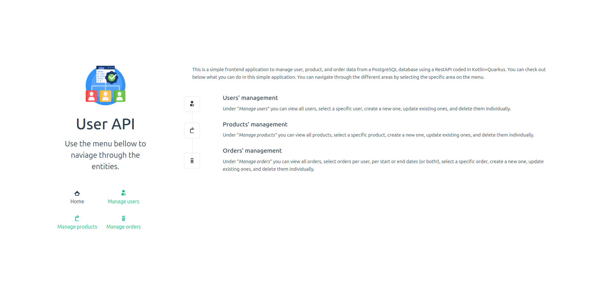
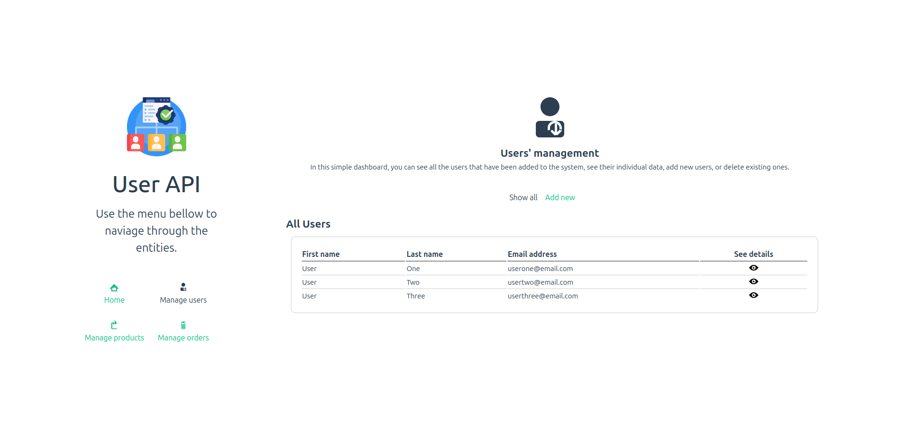
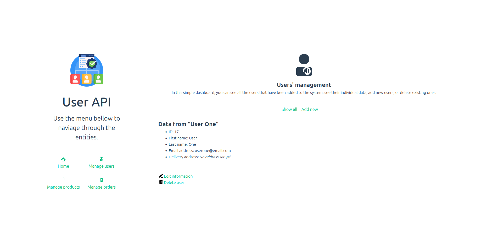
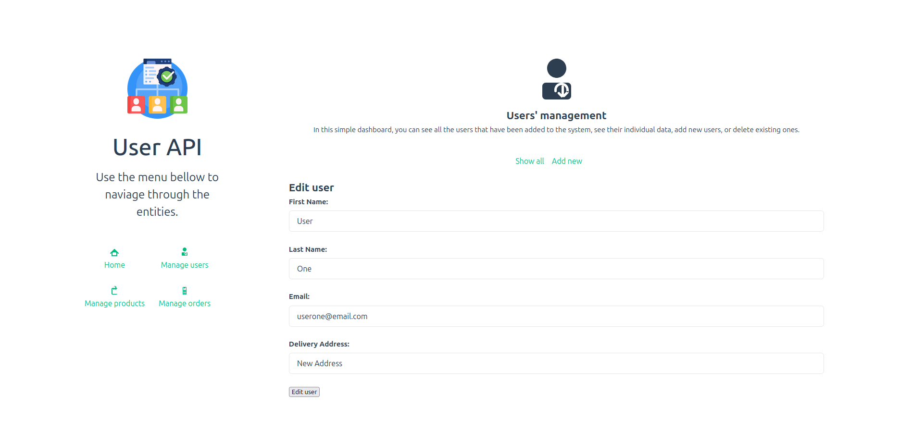

# user-api-exercise-frontend

This simple project allows a user to user the endpoints from the RestAPI coded in Kotlin in another project. It brings a simple dashboard for managing users, products, and orders.

The features of the system are explained in the main page. The specific dashboards can be accessed in the menu.

---

## Users' dashboard

In the users' area, the user can see all users that are saved in the database (checking their first and last name as well as their email addresses). It is also possible to check each individual user. In this area, it is possible to either view all users or to create a new one. In the user's page, it is possible to edit their information or delete them.

| Screenshots |
|-------------|
| Home page  |
| Users' dashboard  |
| Add new user  |
| Checking user data  |
| Delete user  |
| Edit user  |
